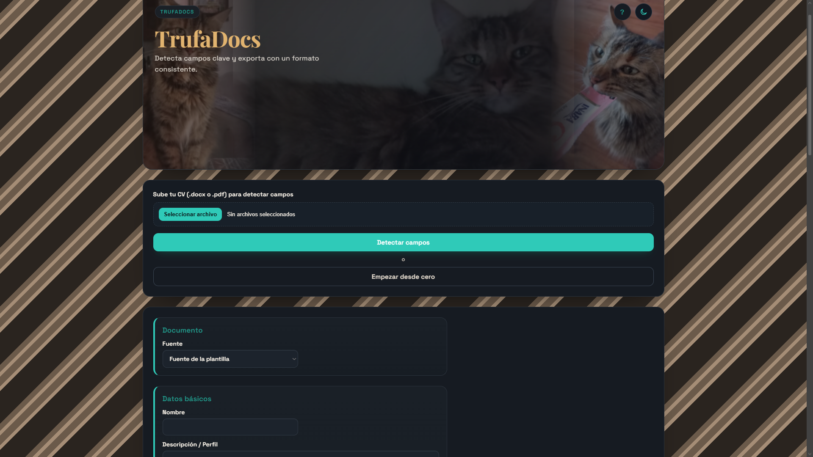
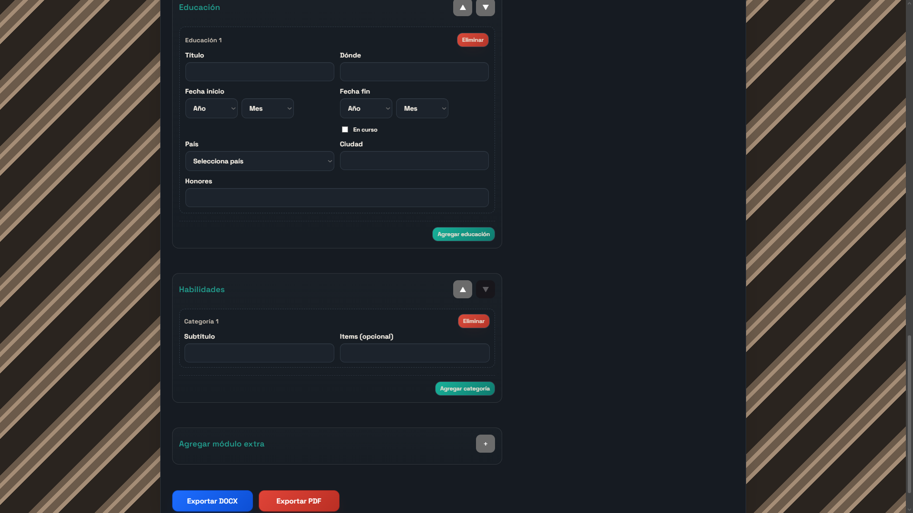

# 📄 TrufaDocs


## 📸 Vista previa

### 🔹 Pantalla de carga y detección de campos



### 🔹 Editor de CV estructurado



---

**TrufaDocs** es una aplicación web construida con **Django** para procesar currículums de forma estructurada.  
Permite importar CVs en `.docx` o `.pdf`, detectar automáticamente los campos, editarlos mediante formularios organizados y exportar el resultado a **DOCX** o **PDF**.

La exportación se basa en una plantilla Word ubicada en:

```
templates/cv_template.docx
```

---

## 💡 Propósito del Proyecto

TrufaDocs nace como una herramienta para:

1. Automatizar la lectura de CVs en distintos formatos.
2. Normalizar información desordenada a una estructura clara.
3. Facilitar la edición de datos mediante un formulario amigable.
4. Generar documentos finales consistentes basados en una plantilla.

También funciona como práctica avanzada de backend con **Django**, manejo de archivos, parsing de texto y generación de documentos.

---

## ✨ Características

- 📄 **Importación de CVs** (`.docx` y `.pdf`)
- 🧠 **Detección heurística de campos**
- 📝 **Formulario estructurado** para edición manual
- 🧩 Separación por secciones:
  - Datos básicos
  - Experiencia
  - Educación
  - Habilidades
  - Extras
- 🧾 **Exportación a DOCX** usando plantilla
- 🖨️ **Exportación a PDF** mediante Word + `docx2pdf`
- 🧪 Redirecciones y validaciones para evitar errores de flujo

---

## 🛠️ Tecnologías

- **Django 6.0.2**
- **python-docx** — generación de documentos Word
- **pdfplumber** — extracción de texto desde PDF
- **docx2pdf** — conversión DOCX → PDF (requiere Word)

---

## 📦 Requisitos

- Python **3.12+** (recomendado)
- Microsoft Word (necesario para exportar a PDF)

---

## 🔧 Instalación

### 1️⃣ Crear entorno virtual

```bash
python -m venv .venv
```

### 2️⃣ Activar entorno virtual

Windows (PowerShell):

```powershell
.\.venv\Scripts\Activate.ps1
```

### 3️⃣ Instalar dependencias

```bash
pip install -r requirements.txt
```

### 4️⃣ Crear archivo de entorno

```bash
copy .env.example .env
```

---

## 🚀 Ejecutar en local

```bash
python manage.py runserver
```

Abrir en el navegador:

```
http://127.0.0.1:8000/
```

---

## 🔄 Flujo de uso

1. Subir un CV desde el panel principal.
2. Presionar **Detectar campos**.
3. Revisar y ajustar los datos en el formulario.
4. Exportar usando:
   - **Exportar DOCX**
   - **Exportar PDF**

---

## 🔗 Endpoints principales

| Método | Ruta                 | Función                    |
| ------ | -------------------- | -------------------------- |
| GET    | `/`                  | Editor principal           |
| POST   | `/upload/`           | Importar y detectar campos |
| POST   | `/text/export/docx/` | Exportar DOCX              |
| POST   | `/text/export/pdf/`  | Exportar PDF               |

📌 `GET /upload/` redirige al index para evitar errores.

---

## ⚙️ Variables de entorno

Configuradas en `trufadocs/settings.py`:

- `DJANGO_SECRET_KEY`
- `DJANGO_DEBUG`
- `DJANGO_ALLOWED_HOSTS`
- `DJANGO_CSRF_TRUSTED_ORIGINS`
- `MAX_UPLOAD_MB`
- `CV_TEMPLATE_PATH`

### Producción (seguridad)

- `DJANGO_SECURE_SSL_REDIRECT`
- `DJANGO_SESSION_COOKIE_SECURE`
- `DJANGO_CSRF_COOKIE_SECURE`
- `DJANGO_SECURE_HSTS_SECONDS`
- `DJANGO_SECURE_HSTS_INCLUDE_SUBDOMAINS`
- `DJANGO_SECURE_HSTS_PRELOAD`
- `DJANGO_SECURE_PROXY_SSL_HEADER`
- `DJANGO_USE_X_FORWARDED_HOST`

Valores de ejemplo en `.env.example`.

---

## 🗄️ Base de datos

El proyecto usa un backend sin persistencia:

- No existen modelos permanentes
- No se guarda historial de CVs

Toda la información se mantiene en memoria durante la sesión.

---

## 🧪 Pruebas

```bash
python manage.py test
```

---

## ⚠️ Limitaciones conocidas

- El parsing de PDF es menos preciso que DOCX, pero mejora con formatos consistentes.
- Exportar PDF depende de Word + `docx2pdf`.
- El resultado final depende de la plantilla DOCX y de las fuentes instaladas.

---

## 📁 Estructura del proyecto

Consultar:

```
arbol.md
```

para ver el árbol actualizado del repositorio.
