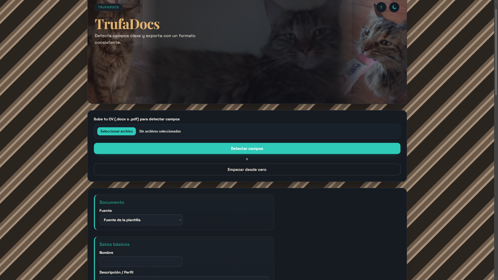
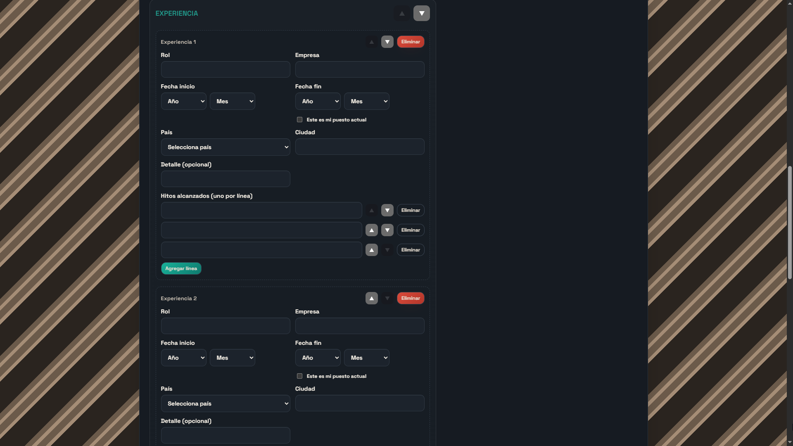

# TrufaDocs


Aplicacion web en Django para importar CVs (`.docx` / `.pdf`), normalizarlos a una estructura editable y exportarlos a DOCX/PDF.

## Vista previa

### Carga de CV y deteccion de campos



### Editor de CV estructurado



---

Documentacion principal:

- [docs/DOCUMENTACION_TECNICA_COMPLETA.md](docs/DOCUMENTACION_TECNICA_COMPLETA.md)
- [ARBOL.md](ARBOL.md)

---

## Estado actual

- Parser de CV con schema unico (`basics`, `experience`, `education`, `skills`, `extra_sections`).
- UI ES/EN con mensajes localizados y persistencia de idioma.
- Reorden de modulos con preservacion de `core_order`.
- Export DOCX por plantilla (`templates/cv_template.docx`).
- Export PDF via `docx2pdf` (requiere Microsoft Word en Windows/macOS).
- Suite de tests enfocada en regresiones de parsing, localizacion y orden.

## Caracteristicas

- Importacion de CVs (`.docx` y `.pdf`)
- Deteccion heuristica de campos
- Formulario estructurado para edicion manual
- Preservacion de orden de modulos (core + extras)
- Exportacion a DOCX usando plantilla
- Exportacion a PDF mediante Word + `docx2pdf`
- Exportacion localizada de encabezados core (ES/EN)

## Stack

- Python 3.12+
- Django 6.0.2
- python-docx 1.2.0
- pdfplumber 0.10.4
- docx2pdf 0.1.8

## Requisitos

- Python 3.12+
- Microsoft Word (para exportacion PDF con `docx2pdf`)

## Instalacion local

```bash
python -m venv .venv
```

PowerShell (Windows):

```powershell
.\.venv\Scripts\Activate.ps1
pip install -r requirements.txt
copy .env.example .env
python manage.py runserver
```

Bash (Linux/macOS):

```bash
source .venv/bin/activate
pip install -r requirements.txt
cp .env.example .env
python manage.py runserver
```

Abrir: `http://127.0.0.1:8000/`

## Flujo de uso

1. Subir un CV desde el panel principal.
2. (Opcional) Cambiar idioma con el boton ES/EN.
3. Presionar Detectar campos.
4. Revisar y ajustar los datos en el formulario.
5. Exportar DOCX o PDF.

## Endpoints

| Metodo | Ruta                 | Uso |
| ------ | -------------------- | --- |
| GET    | `/`                  | Editor principal |
| POST   | `/upload/`           | Importar y detectar campos |
| POST   | `/text/export/docx/` | Exportar DOCX |
| POST   | `/text/export/pdf/`  | Exportar PDF |

Nota: `GET /upload/` redirige a `/`.

## Variables de entorno

Definidas en `.env.example` y consumidas en `trufadocs/settings.py`.

Minimas:

- `DJANGO_SECRET_KEY`
- `DJANGO_DEBUG`
- `DJANGO_ALLOWED_HOSTS`
- `MAX_UPLOAD_MB`
- `CV_TEMPLATE_PATH`

Produccion (seguridad):

- `DJANGO_CSRF_TRUSTED_ORIGINS`
- `DJANGO_SECURE_SSL_REDIRECT`
- `DJANGO_CSRF_COOKIE_SECURE`
- `DJANGO_SECURE_HSTS_SECONDS`
- `DJANGO_SECURE_HSTS_INCLUDE_SUBDOMAINS`
- `DJANGO_SECURE_HSTS_PRELOAD`
- `DJANGO_SECURE_PROXY_SSL_HEADER`
- `DJANGO_USE_X_FORWARDED_HOST`

## Tests

```bash
python manage.py test editor.tests
```

## Limitaciones conocidas

- El parsing de PDF puede ser menos preciso que DOCX segun el formato origen.
- Exportar PDF depende de Word + `docx2pdf`.
- El resultado final depende de la plantilla DOCX y de las fuentes instaladas.

